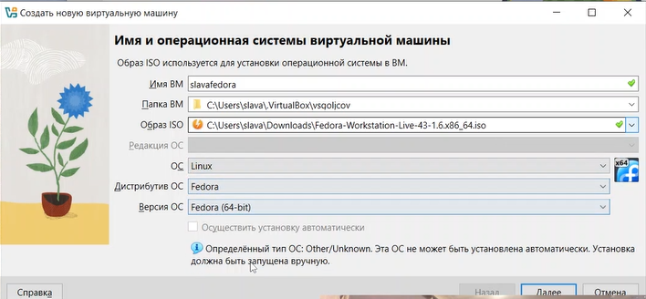
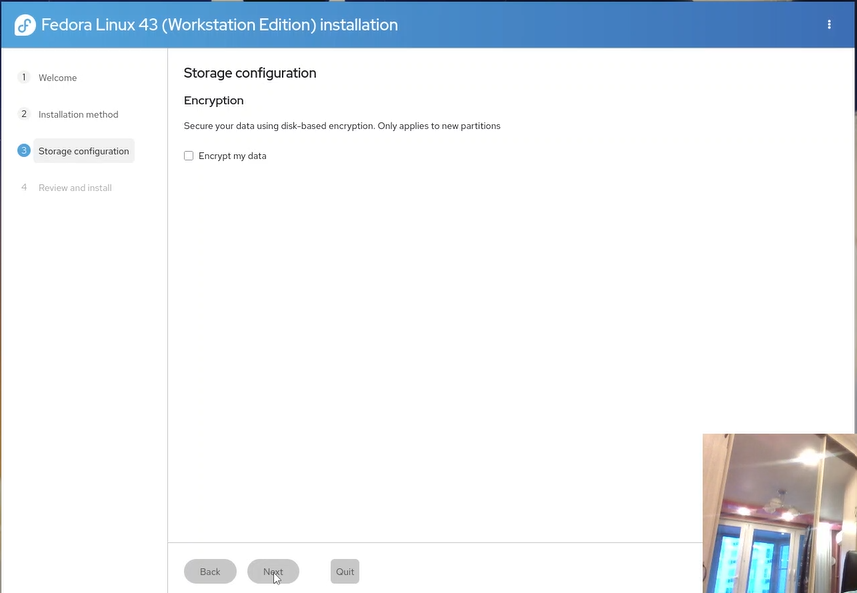
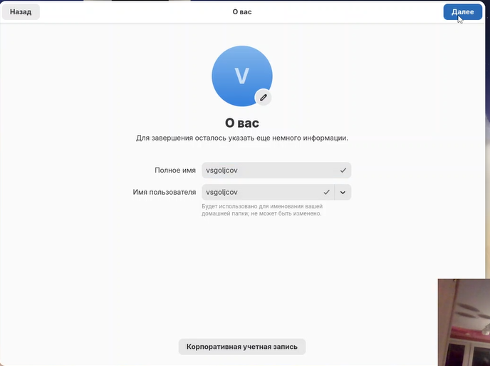

title: "Лабораторная работа №1"
subtitle: "Установка и настройка операционной системы Linux"
author: "vsgoljcov"
date: "2026"
lang: ru-RU
toc: true
toc-depth: 2
numbersections: true
fontsize: 12pt
geometry: margin=2cm
---
# Цель работы

Приобретение навыков установки и первичной настройки операционной системы Linux (дистрибутив Fedora) в среде виртуализации VirtualBox, а также освоение базовых команд для работы в терминале и подготовки документации.

# Выполнение работы

## Создание виртуальной машины

В программе VirtualBox была создана новая виртуальная машина. Параметры:
- **Имя:** `vsgoljcov`
- **Тип ОС:** Linux
- **Версия:** Fedora (64-bit)
- **Оперативная память:** 4096 МБ
- **Жёсткий диск:** 50 ГБ, динамический
- **Сеть:** NAT



## Установка операционной системы

Запущена установка Fedora с ISO-образа. На этапе настройки пользователя заданы:
- имя пользователя: `vsgoljcov`
- имя хоста: `vsgoljcov`
- пароль





После завершения установки ISO-образ отключён, выполнена перезагрузка.

## Первоначальная настройка системы

После входа в систему открыт терминал (Win+Enter). Получены права root:

```bash
sudo -i
Отключён проблемный репозиторий:

bash
mv /etc/yum.repos.d/fedora-cisco-openh264.repo /etc/yum.repos.d/fedora-cisco-openh264.repo.bak
Установлены необходимые пакеты:

bash
dnf -y group install development-tools
dnf -y install tmux mc kitty dnf-automatic
https://images/dnf-install.png

Настроено автоматическое обновление:

bash
systemctl enable --now dnf-automatic.timer
systemctl status dnf-automatic.timer
https://images/dnf-automatic-status.png

SELinux переведён в режим permissive. Для этого в файле /etc/selinux/config параметр SELINUX=enforcing заменён на SELINUX=permissive.

https://images/selinux-config.png

Выполнено обновление всех пакетов и перезагрузка:

bash
dnf -y update
systemctl reboot
Установка ПО для документации
Установлен pandoc:

bash
dnf -y install pandoc
Установлен полный дистрибутив TeX Live:

bash
dnf -y install texlive-scheme-full
Установлен pandoc-crossref:

bash
cd /tmp
wget https://github.com/lierdakil/pandoc-crossref/releases/download/v0.3.23a/pandoc-crossref-Linux-X64.tar.xz
tar -xf pandoc-crossref-Linux-X64.tar.xz
mv pandoc-crossref /usr/local/bin/
chmod +x /usr/local/bin/pandoc-crossref
Проверка версий:

bash
pandoc --version | head -n 1
pandoc-crossref --version | head -n 1
https://images/pandoc-versions.png

Анализ загрузки системы (команда dmesg)
Для получения информации о системе использована команда dmesg. Результаты представлены ниже.

Версия ядра Linux:

bash
dmesg | grep -i "linux version"
Частота процессора:

bash
dmesg | grep -i "detected.*mhz"
Модель процессора (CPU0):

bash
dmesg | grep -i "cpu0"
Объём доступной оперативной памяти:

bash
grep MemTotal /proc/meminfo
Тип обнаруженного гипервизора:

bash
dmesg | grep -i "hypervisor detected"
Тип файловой системы корневого раздела:

bash
findmnt / -o FSTYPE,SOURCE,TARGET
Последовательность монтирования файловых систем:

bash
dmesg | grep -i "mount" | tail -20
https://images/dmesg.png

Выводы
В ходе выполнения лабораторной работы была установлена и настроена операционная система Fedora Linux в среде VirtualBox. Выполнены все необходимые шаги: установка средств разработки, настройка автоматического обновления, отключение SELinux, установка pandoc и TeX Live. Проведён анализ загрузки системы с помощью команды dmesg, получена информация об аппаратном обеспечении виртуальной машины.

Контрольные вопросы
1. Какую информацию содержит учётная запись пользователя?
Учётная запись пользователя в Linux содержит:

имя пользователя (login);

UID (идентификатор пользователя);

GID (идентификатор основной группы);

домашний каталог (например, /home/vsgoljcov);

командную оболочку (shell), например /bin/bash;

зашифрованный пароль (хранится в /etc/shadow);

комментарий (обычно полное имя пользователя).

Просмотр информации о текущем пользователе:

bash
id
cat /etc/passwd | grep vsgoljcov
2. Команды терминала с примерами
Действие	Команда	Пример
Справка по команде	man, --help	man ls, ls --help
Перемещение по ФС	cd	cd /home, cd .., cd ~
Просмотр содержимого	ls	ls -la
Определение объёма	du, df	du -sh /home, df -h
Создание/удаление	touch, mkdir, rm	touch file.txt, mkdir dir, rm -r dir
Права доступа	chmod, chown	chmod 755 script.sh, chown user:group file
История команд	history	history, !!, !100
3. Что такое файловая система? Примеры
Файловая система — это способ организации и хранения данных на диске. Примеры:

ext4 — стандартная для Linux, журналируемая, поддерживает большие файлы и тома.

XFS — высокопроизводительная, хороша для больших файлов.

btrfs — современная, поддерживает снапшоты, сжатие, проверку целостности.

FAT32 — старая, совместимая со всеми ОС, ограничение 4 ГБ на файл.

NTFS — стандартная для Windows, журналируемая, поддерживает права доступа.

4. Как посмотреть подмонтированные файловые системы?
bash
mount
findmnt
df -hT
cat /proc/mounts
5. Как удалить зависший процесс?
Найти PID процесса:

bash
ps aux | grep имя_процесса
Отправить сигнал завершения:

bash
kill PID
Если не завершается:

bash
kill -9 PID
Завершить все процессы с именем:

bash
pkill имя_процесса
