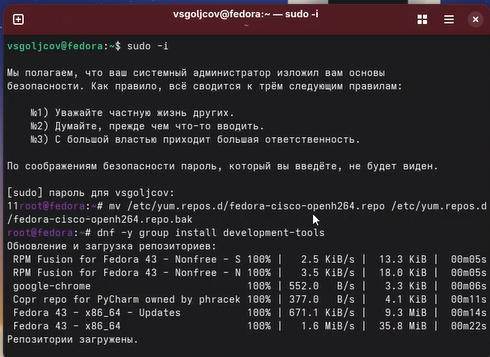
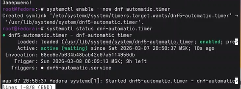
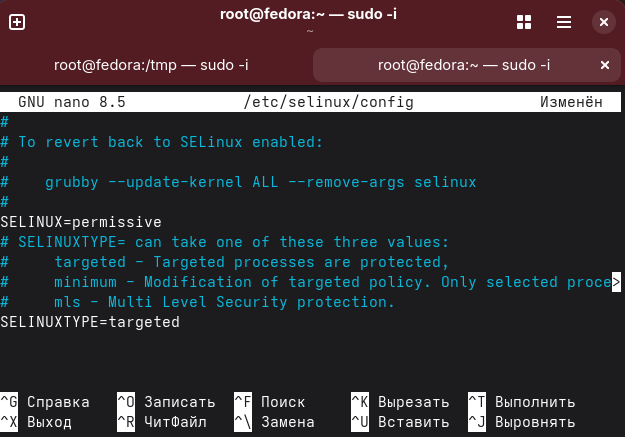
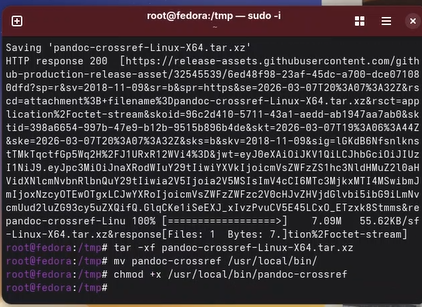
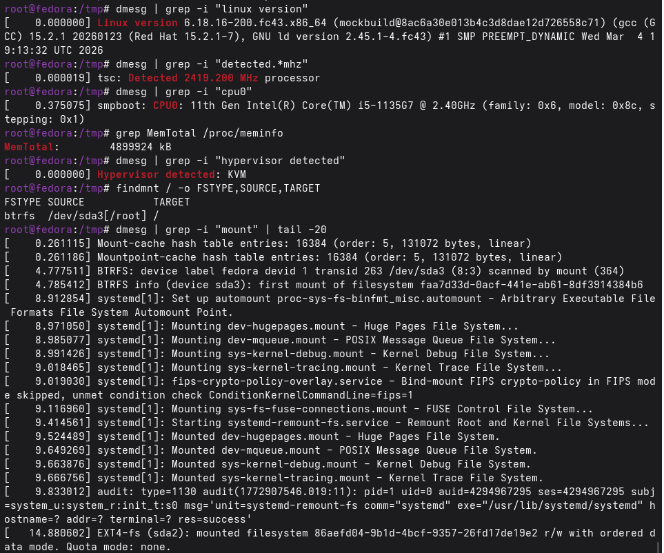

# Лабораторная работа №1
## Установка и настройка операционной системы Linux

**Автор:** vsgoljcov  
**Дата:** 2026

---

# Цель работы

Приобретение навыков установки и первичной настройки операционной системы Linux (дистрибутив Fedora) в среде виртуализации VirtualBox, а также освоение базовых команд для работы в терминале и подготовки документации.

# Выполнение работы

## Создание виртуальной машины

В программе VirtualBox была создана новая виртуальная машина. Параметры:
- **Имя:** `vsgoljcov`
- **Тип ОС:** Linux
- **Версия:** Fedora (64-bit)
- **Оперативная память:** 4096 МБ
- **Жёсткий диск:** 50 ГБ, динамический
- **Сеть:** NAT

## Установка операционной системы

Запущена установка Fedora с ISO-образа. На этапе настройки пользователя заданы:
- имя пользователя: `vsgoljcov`
- имя хоста: `vsgoljcov`
- пароль

После завершения установки ISO-образ отключён, выполнена перезагрузка.

## Первоначальная настройка системы

После входа в систему открыт терминал (Win+Enter). Получены права root:
sudo -i

text

Отключён проблемный репозиторий:
mv /etc/yum.repos.d/fedora-cisco-openh264.repo /etc/yum.repos.d/fedora-cisco-openh264.repo.bak

text

Установлены необходимые пакеты:
dnf -y group install development-tools
dnf -y install tmux mc kitty dnf-automatic

text

Настроено автоматическое обновление:
systemctl enable --now dnf-automatic.timer
systemctl status dnf-automatic.timer

text

SELinux переведён в режим permissive. Для этого в файле `/etc/selinux/config` параметр `SELINUX=enforcing` заменён на `SELINUX=permissive`.

Выполнено обновление всех пакетов и перезагрузка:
dnf -y update
systemctl reboot

text

## Установка ПО для документации

Установлен pandoc:
dnf -y install pandoc

text

Установлен полный дистрибутив TeX Live:
dnf -y install texlive-scheme-full

text

Установлен pandoc-crossref:
cd /tmp
wget https://github.com/lierdakil/pandoc-crossref/releases/download/v0.3.23a/pandoc-crossref-Linux-X64.tar.xz
tar -xf pandoc-crossref-Linux-X64.tar.xz
mv pandoc-crossref /usr/local/bin/
chmod +x /usr/local/bin/pandoc-crossref

text

Проверка версий:
pandoc --version | head -n 1
pandoc-crossref --version | head -n 1

text

## Анализ загрузки системы (команда dmesg)

Для получения информации о системе использована команда `dmesg`. Результаты представлены ниже.

**Версия ядра Linux:**
dmesg | grep -i "linux version"

text

**Частота процессора:**
dmesg | grep -i "detected.*mhz"

text

**Модель процессора (CPU0):**
dmesg | grep -i "cpu0"

text

**Объём доступной оперативной памяти:**
grep MemTotal /proc/meminfo

text

**Тип обнаруженного гипервизора:**
dmesg | grep -i "hypervisor detected"

text

**Тип файловой системы корневого раздела:**
findmnt / -o FSTYPE,SOURCE,TARGET

text

**Последовательность монтирования файловых систем:**
dmesg | grep -i "mount" | tail -20

text

# Выводы

В ходе выполнения лабораторной работы была установлена и настроена операционная система Fedora Linux в среде VirtualBox. Выполнены все необходимые шаги: установка средств разработки, настройка автоматического обновления, отключение SELinux, установка pandoc и TeX Live. Проведён анализ загрузки системы с помощью команды `dmesg`, получена информация об аппаратном обеспечении виртуальной машины.

# Контрольные вопросы

## 1. Какую информацию содержит учётная запись пользователя?

Учётная запись пользователя в Linux содержит:
- **имя пользователя** (login);
- **UID** (идентификатор пользователя);
- **GID** (идентификатор основной группы);
- **домашний каталог** (например, `/home/vsgoljcov`);
- **командную оболочку** (shell), например `/bin/bash`;
- **зашифрованный пароль** (хранится в `/etc/shadow`);
- **комментарий** (обычно полное имя пользователя).

Просмотр информации о текущем пользователе:
id
cat /etc/passwd | grep vsgoljcov

text

## 2. Команды терминала с примерами

| Действие | Команда | Пример |
|----------|---------|--------|
| Справка по команде | `man`, `--help` | `man ls`, `ls --help` |
| Перемещение по ФС | `cd` | `cd /home`, `cd ..`, `cd ~` |
| Просмотр содержимого | `ls` | `ls -la` |
| Определение объёма | `du`, `df` | `du -sh /home`, `df -h` |
| Создание/удаление | `touch`, `mkdir`, `rm` | `touch file.txt`, `mkdir dir`, `rm -r dir` |
| Права доступа | `chmod`, `chown` | `chmod 755 script.sh`, `chown user:group file` |
| История команд | `history` | `history`, `!!`, `!100` |

## 3. Что такое файловая система? Примеры

**Файловая система** — это способ организации и хранения данных на диске. Примеры:

- **ext4** — стандартная для Linux, журналируемая, поддерживает большие файлы и тома.
- **XFS** — высокопроизводительная, хороша для больших файлов.
- **btrfs** — современная, поддерживает снапшоты, сжатие, проверку целостности.
- **FAT32** — старая, совместимая со всеми ОС, ограничение 4 ГБ на файл.
- **NTFS** — стандартная для Windows, журналируемая, поддерживает права доступа.

## 4. Как посмотреть подмонтированные файловые системы?
mount
findmnt
df -hT
cat /proc/mounts

text

## 5. Как удалить зависший процесс?

1. Найти PID процесса:
ps aux | grep имя_процесса

text
2. Отправить сигнал завершения:
kill PID

text
3. Если не завершается:
kill -9 PID

text
4. Завершить все процессы с именем:
pkill имя_процесса
